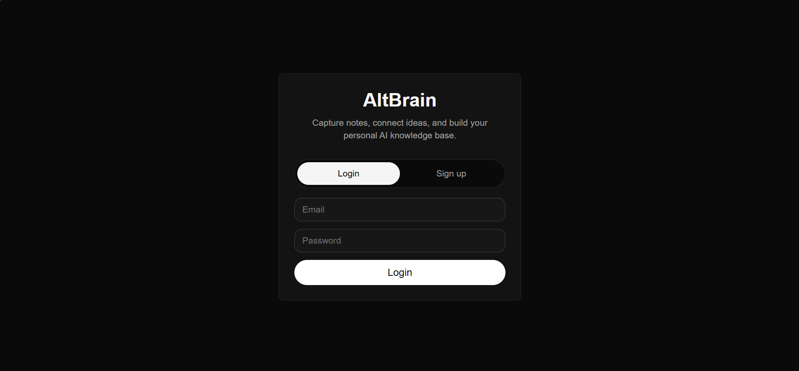
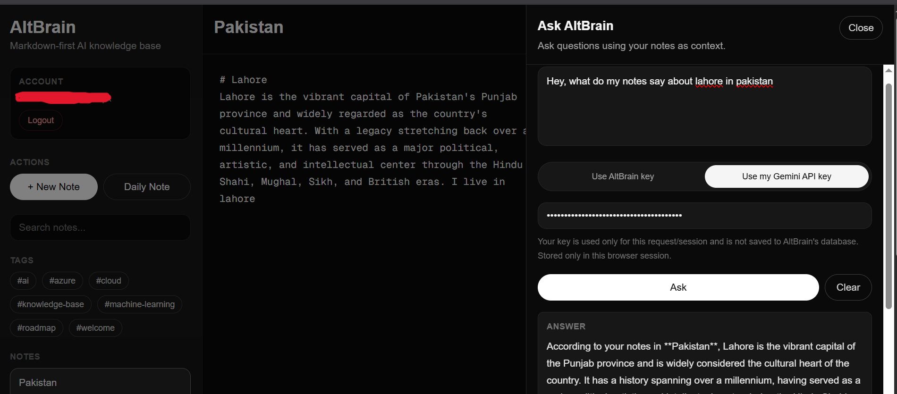

# AltBrain

AltBrain is a markdown-first personal AI knowledge base that helps users capture notes, connect ideas, and ask AI questions over their personal knowledge.

Live app: https://altbrain-taupe.vercel.app/

## Overview

AltBrain is inspired by tools like Logseq and Obsidian, but adds an AI assistant layer on top of personal notes. Users can write markdown notes, organize them with tags and wiki-style links, view backlinks, create daily notes, and ask AI questions using their own notes as context.

The main inspiration behind the project is to have a centralized, organized space for all your ideas and knowledge, acting like a second brain (hence the name 'Altbrain').

The project is built as a full-stack AI application using Next.js, Supabase, and Gemini API.

## Features

* Email/password authentication with Supabase Auth
* User-owned notes stored in Supabase Postgres
* Row Level Security so users can only access their own notes
* Markdown editor with live preview
* GitHub-style markdown support
* Tags using `#tag` syntax
* Wiki-style page links using `[[Page Name]]`
* Backlinks between notes
* Daily notes
* Search across notes
* AI assistant over personal notes
* Source notes shown with AI answers
* Two Gemini API modes:

  * Use the configured AltBrain API key
  * Bring your own Gemini API key for the session
* Responsive dark UI
* Deployed on Vercel

## Screenshots
### Landing Page of Altbrain:

### Example AI Mode Usage:


## Tech Stack

* Next.js App Router
* TypeScript
* Tailwind CSS
* Supabase Auth
* Supabase Postgres
* Supabase Row Level Security
* Gemini API
* Vercel

## Architecture

AltBrain uses Supabase for authentication and user-owned note storage. The AI assistant is implemented through a secure Next.js API route so the configured Gemini API key is never exposed to the browser.

```text
Browser
  -> Next.js App
  -> Supabase Auth
  -> Supabase Postgres

Browser
  -> Next.js API Route
  -> Gemini API
```

For the bring-your-own-key mode, the user's Gemini API key is used only for the current request/session and is not saved to AltBrain's database.

## Current Limitations

This is the first MVP version. Current AI retrieval uses a lightweight keyword-based note selection approach before sending context to the LLM. Future versions could use embeddings and semantic retrieval for a stronger RAG performance.

## Tentative Roadmap & Possible Features

* Semantic search with embeddings
* pgvector-based retrieval
* Persistent AI chat history
* PDF upload and document ingestion
* Cited RAG over notes and documents
* OAuth login
* More polished note editor
* Block-based Logseq-style editing
* Graph view for linked notes

## Local Development

Clone the repository and install dependencies:

```bash
npm install
```

Create a `.env.local` file:

```env
NEXT_PUBLIC_SUPABASE_URL=your_supabase_project_url
NEXT_PUBLIC_SUPABASE_PUBLISHABLE_KEY=your_supabase_publishable_key
GEMINI_API_KEY=your_gemini_api_key
```

Run the development server:

```bash
npm run dev
```

Open:

```text
http://localhost:3000
```

## Environment Variables

| Variable                               | Purpose                                                          |
| -------------------------------------- | ---------------------------------------------------------------- |
| `NEXT_PUBLIC_SUPABASE_URL`             | Supabase project URL                                             |
| `NEXT_PUBLIC_SUPABASE_PUBLISHABLE_KEY` | Supabase client-side publishable key                             |
| `GEMINI_API_KEY`                       | Server-side Gemini API key used by AltBrain's configured AI mode |
